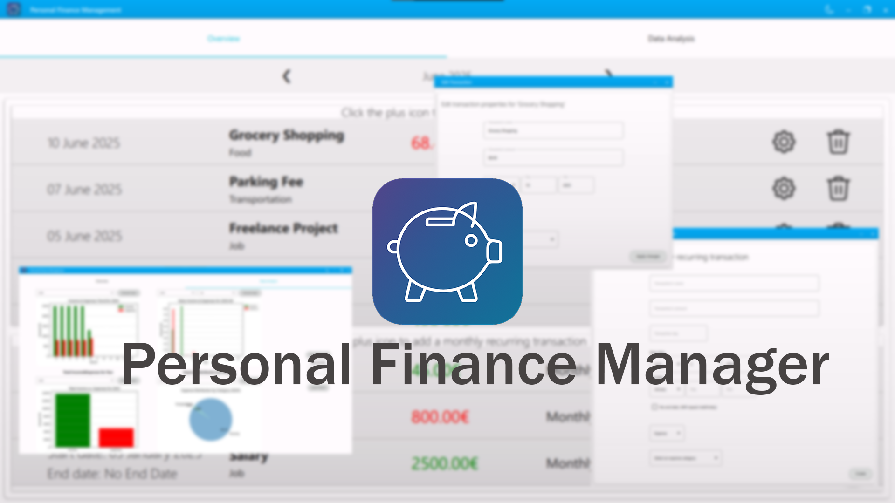

<div align="center">

# Personal Finance Management
**A simple app for keeping track of personal finances.**


</div>

## About
Personal Finance Management(PFM) is a straightforward application designed for managing personal finances. The app enables users to track their financial transactions and visualize financial patterns through graphical representation. 

This project was built as a first-year HOU university assignment. The project topic, requirements, and the main language used have been dictated by the university. While we aimed to maintain professional development standards, we adopted a more beginner-friendly approach suitable for first-year students. Due to time constraints and academic deadlines, certain non-required features and complexities have been omitted.

## Running from source 
This requires some technical expertise. Alternatively, you can use the compiled executable from the [latest release](https://github.com/Yiannis123Git/PersonalFinanceManagement/releases/latest).

### Prerequisites
- **Python 3.13** must be installed on your system. Download it from [python.org](https://www.python.org/downloads/)
- **Git** must be installed on your device. Download it from [git-scm.com](https://git-scm.com/downloads)

### Clone the repository
```bash
git clone https://github.com/Yiannis123Git/PersonalFinanceManagement.git
cd PersonalFinanceManagement
```

### Installing dependencies
This project uses [Poetry](https://python-poetry.org/) for dependency management. Installing Poetry via pipx is recommended but there are other available methods as well. For more info take a look at the [Poetry documentation page](https://python-poetry.org/docs/) installation instructions.

After installing Poetry, run `poetry install` on the cloned repository.

### Generate qml_rc.py file
After installing the project's dependencies you can generate a qml python resource file by running the following at the project's root

```bash
poetry run pyside6-rcc ./src/ui/qml.qrc -o ./src/ui/qml_rc.py
```

### Running the program
Once you have completed the previous steps, you can run the application using the following command:
```bash
poetry run python ./src/main.py  
```

## Usage

### Managing Transactions In The Overview Tab

#### Creating Transactions
- Click the **plus icon** in the transaction list to create a new transaction
- Fill out all the fields in order to create the new transaction
- For monthly recurring transactions, click the plus icon in the monthly recurring transactions section and set up your recurring transaction accordingly

**Note:** Recurring transactions automatically generate individual transactions from their start date up to current date. Future transactions will be created each month as their time comes. Transactions generated can be managed independently, but they will be reconciled if a monthly recurring transaction's properties are modified.

#### Editing Transactions
- Click the **cog icon** next to any transaction to modify its details.
- Update any field as needed and apply your changes.

#### Deleting Transactions
- Click the **bin icon** to remove a transaction.
- Confirm the deletion when prompted.

### Managing Categories

#### Creating Categories
- Expand the category dropdown in the transaction creation/edit window.
- Click **"Create New Category"** to add a new category.
- Enter the category name when prompted and click create.

#### Editing Categories
- Click the **cog icon** next to any category name in the dropdown.
- Change the category name and apply your changes.

#### Deleting Categories
- Click the **bin icon** next to any category name to delete it.
- Confirm the deletion when prompted.

**Warning:** Deleting a category will also delete all associated transactions(Including monthly recurring transactions).

### Analyzing Finances in the Data Analysis Tab

#### Generating and viewing charts
- Open the Data Analysis Tab from the navigation bar.
- Each chart includes drop down menus for selecting the the desired year and in some cases month, depending on the chart.
- After making your selections, click the **Generate Graph** button to display the desired chart

**Note:** Charts do *not* refresh automatically. You must click **Generate Graph** after changning the time period or modifying your data.

#### Exporting Data
- Use the *panel on the right side* of the Data Analysis Tab to export financial data.

##### Export All to Excel
- Click this button to export **all your transaction data** to an Excel file.

##### Export by Date
- Use the **Year** and **Month** dropdowns to select a specific time period.
- Then click the **Export Filtered** button to export only the transaction for the selected month and year.

**Note:** Exported files are generated as **.xlsx** spreadsheets and saved using your system's default prompt.
    
